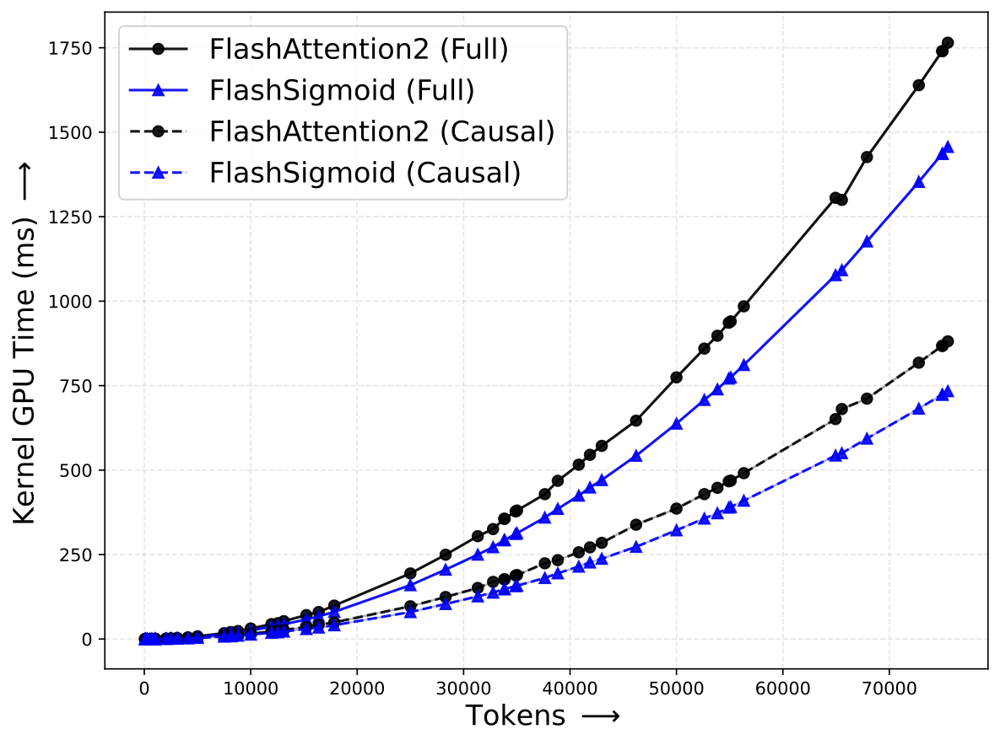
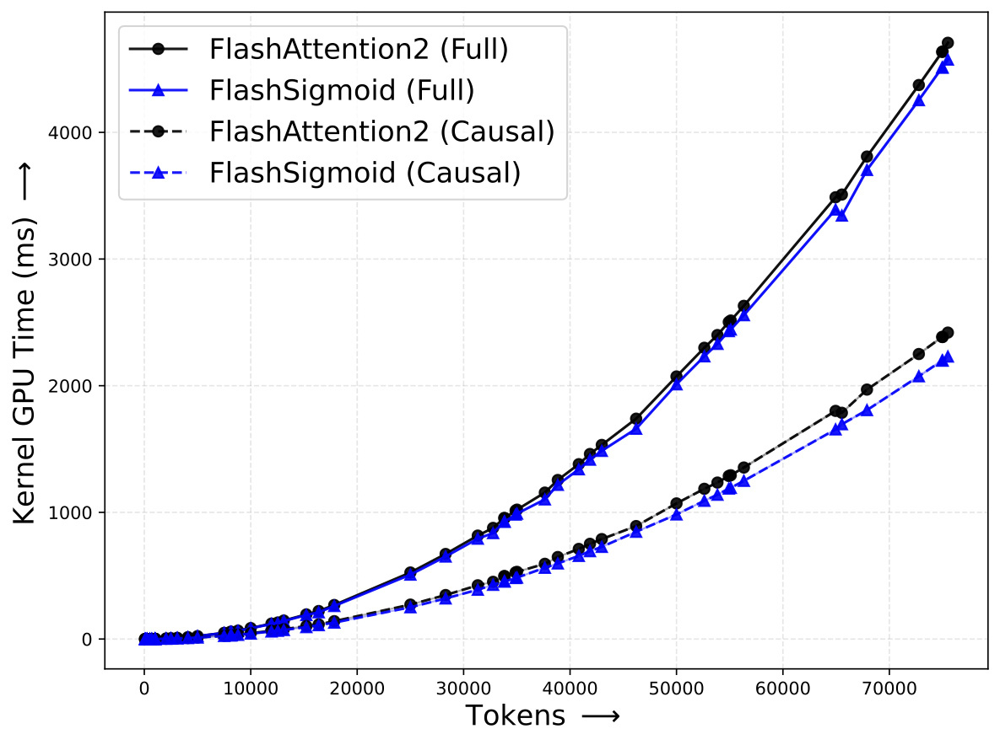
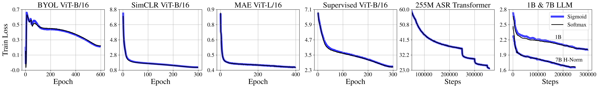

# Sigmoid Attention (ICLR 2025)

This repo contains the code associated with [Theory, Analysis, and Best Practices for
Sigmoid Self-Attention](https://arxiv.org/abs/2409.04431).

## Components

The four components of this release are:

  - [FlashSigmoid](./flash_sigmoid): A hardware aware implementation of Sigmoid Attention.
  - [Optorch](./optorch): PyTorch-based functional implementation of standard optimizers.
  - [Attention Simulator](./attention_simulator): A research friendly codebase for diagnosing and debugging attention.
  - (**New**) [7B weights](./pretrained/axlearn_load_pretrained.ipynb): One-to-one trained 7B sigmoid and 7B softmax weights (8 checkpoints along trajectory) trained using [AXLearn](https://github.com/apple/axlearn), with a deterministic dataloader for 1T tokens.

## Installation

See the `README.md` in the corresponding component for installation and usage instructions.  

We provide a convenience installation helper for all three packages:
```bash
# Create an environment for sigmoid attention, if not done already.
conda create -n sigmoid-attn-py310 python=3.10
conda activate sigmoid-attn-py310

# Setup Flashsigmoid -> Optorch -> Attention Simulator.
bash setup.bash
```

## Performance

|                                      Forward pass kernels on H100.                                       |                                Backward pass kernels on H100.                                |
|:--------------------------------------------------------------------------------------------------------:|:--------------------------------------------------------------------------------------------:|
|  |  |


|                   Train losses comparing SigmoidAttn with SoftmaxAttn.                   |
|:----------------------------------------------------------------------------------------:|
|  |


## Citation
If you find this work useful in your research, please cite:
```
@inproceedings{ramapuram2025theoryanalysisbestpractices,
  title={Theory, Analysis, and Best Practices for Sigmoid Self-Attention},
  author={Jason Ramapuram and Federico Danieli and Eeshan Dhekane and Floris Weers and Dan Busbridge and Pierre Ablin and Tatiana Likhomanenko and Jagrit Digani and Zijin Gu and Amitis Shidani and Russ Webb},
  booktitle={International Conference on Learning Representations (ICLR)},
  year={2025},
  url={https://openreview.net/forum?id=Zhdhg6n2OG}
}
```
